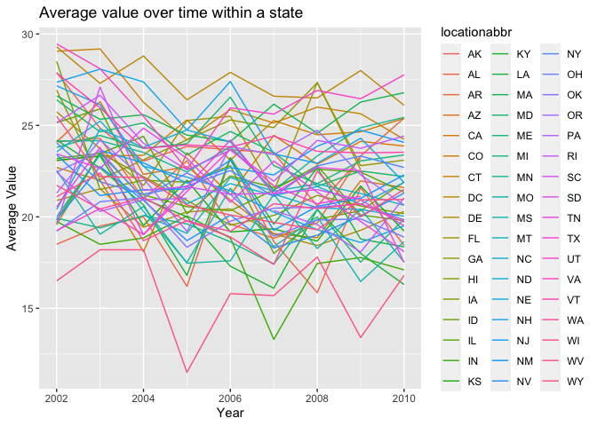
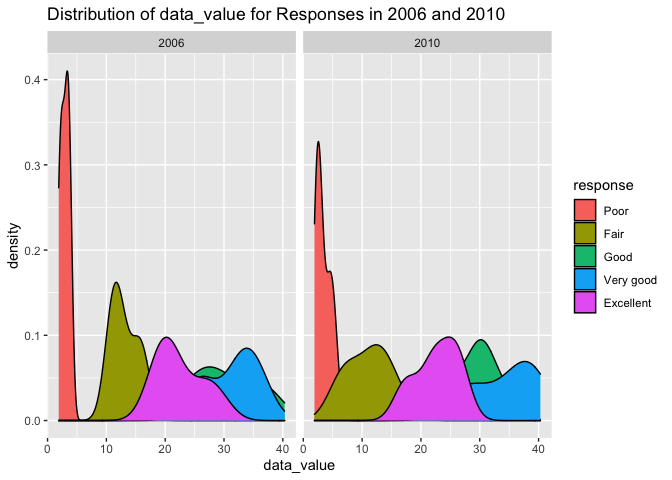
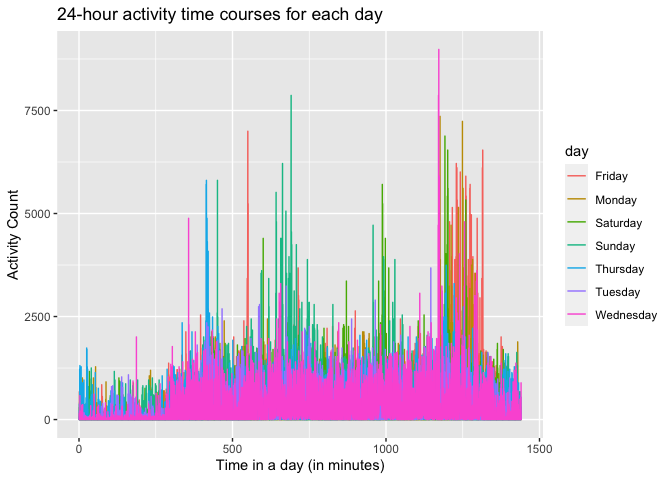

p8105\_hw3\_tg2753
================

``` r
library(tidyverse)
```

    ## ── Attaching packages ─────────────────────────────────────── tidyverse 1.3.1 ──

    ## ✓ ggplot2 3.3.3     ✓ purrr   0.3.4
    ## ✓ tibble  3.1.4     ✓ dplyr   1.0.5
    ## ✓ tidyr   1.1.3     ✓ stringr 1.4.0
    ## ✓ readr   1.4.0     ✓ forcats 0.5.1

    ## ── Conflicts ────────────────────────────────────────── tidyverse_conflicts() ──
    ## x dplyr::filter() masks stats::filter()
    ## x dplyr::lag()    masks stats::lag()

``` r
library(p8105.datasets)
```

## Problem 1

load the data

``` r
data("instacart")
```

There are 1384617 rows and 15 columns. Key Variables include order\_id,
product\_id, add\_to\_cart\_order, reordered, user\_id, eval\_set,
order\_number, order\_dow, order\_hour\_of\_day,
days\_since\_prior\_order, product\_name, aisle\_id, department\_id,
aisle, department. Key observations are :

| order\_id | product\_id | add\_to\_cart\_order | reordered | user\_id | eval\_set | order\_number | order\_dow | order\_hour\_of\_day | days\_since\_prior\_order | product\_name                                 | aisle\_id | department\_id | aisle                | department   |
| --------: | ----------: | -------------------: | --------: | -------: | :-------- | ------------: | ---------: | -------------------: | ------------------------: | :-------------------------------------------- | --------: | -------------: | :------------------- | :----------- |
|         1 |       49302 |                    1 |         1 |   112108 | train     |             4 |          4 |                   10 |                         9 | Bulgarian Yogurt                              |       120 |             16 | yogurt               | dairy eggs   |
|         1 |       11109 |                    2 |         1 |   112108 | train     |             4 |          4 |                   10 |                         9 | Organic 4% Milk Fat Whole Milk Cottage Cheese |       108 |             16 | other creams cheeses | dairy eggs   |
|         1 |       10246 |                    3 |         0 |   112108 | train     |             4 |          4 |                   10 |                         9 | Organic Celery Hearts                         |        83 |              4 | fresh vegetables     | produce      |
|         1 |       49683 |                    4 |         0 |   112108 | train     |             4 |          4 |                   10 |                         9 | Cucumber Kirby                                |        83 |              4 | fresh vegetables     | produce      |
|         1 |       43633 |                    5 |         1 |   112108 | train     |             4 |          4 |                   10 |                         9 | Lightly Smoked Sardines in Olive Oil          |        95 |             15 | canned meat seafood  | canned goods |
|         1 |       13176 |                    6 |         0 |   112108 | train     |             4 |          4 |                   10 |                         9 | Bag of Organic Bananas                        |        24 |              4 | fresh fruits         | produce      |

–How many aisles are there, and which aisles are the most items ordered
from?

``` r
aisle = 
  instacart %>% 
  group_by(aisle) %>% 
  summarise(n_obs = n()) %>%
  arrange(desc(n_obs))
```

There are 134 aisles. The aisle that are ordered most from is aisle
`fresh vegetables`.

–Make a plot that shows the number of items ordered in each aisle,
limiting this to aisles with more than 10000 items ordered. Arrange
aisles sensibly, and organize your plot so others can read it.

``` r
aisle %>%  
  filter(n_obs >= 10000) %>% 
  mutate(
    aisle = factor(aisle),
    aisle = fct_reorder(aisle, n_obs)
  ) %>%
  ggplot(aes(x = n_obs, y = aisle, fill = aisle)) +
  geom_bar(stat = "identity") +
  guides(fill = FALSE) +
  labs(
    title = "Number of orders from each aisle",
    x = "Number of orders",
    y = "Aisle",
    captions = "Aisles with >= 10000 orders only"
  )
```

<!-- -->
–Make a table showing the three most popular items in each of the
aisles “baking ingredients”, “dog food care”, and “packaged vegetables
fruits”. Include the number of times each item is ordered in your table.

``` r
instacart %>% 
    filter(aisle %in% c("baking ingredients", "dog food care", "packaged vegetables fruits")) %>% 
    group_by(aisle) %>% 
    count(product_name) %>%
    mutate(rank = min_rank(desc(n))) %>% 
    filter(rank < 4) %>% 
    arrange(aisle, rank) %>% 
    knitr::kable()
```

| aisle                      | product\_name                                 |    n | rank |
| :------------------------- | :-------------------------------------------- | ---: | ---: |
| baking ingredients         | Light Brown Sugar                             |  499 |    1 |
| baking ingredients         | Pure Baking Soda                              |  387 |    2 |
| baking ingredients         | Cane Sugar                                    |  336 |    3 |
| dog food care              | Snack Sticks Chicken & Rice Recipe Dog Treats |   30 |    1 |
| dog food care              | Organix Chicken & Brown Rice Recipe           |   28 |    2 |
| dog food care              | Small Dog Biscuits                            |   26 |    3 |
| packaged vegetables fruits | Organic Baby Spinach                          | 9784 |    1 |
| packaged vegetables fruits | Organic Raspberries                           | 5546 |    2 |
| packaged vegetables fruits | Organic Blueberries                           | 4966 |    3 |

–Make a table showing the mean hour of the day at which Pink Lady Apples
and Coffee Ice Cream are ordered on each day of the week; format this
table for human readers

``` r
instacart %>% 
    filter(product_name %in% c("Pink Lady Apples", "Coffee Ice Cream")) %>% 
    group_by(product_name, order_dow) %>% 
    summarize(mean_hour = mean(order_hour_of_day)) %>%
    mutate(order_dow = recode(order_dow,
                            "0" = "Monday",
                            "1" = "Tuesday",
                            "2" = "Wednesday", 
                            "3" = "Thursday",
                            "4" = "Friday",
                            "5" = "Saturday",
                            "6" = "Sunday"
                             )) %>% 
    pivot_wider(
        names_from = order_dow,
        values_from = mean_hour
    ) %>%
 knitr::kable()
```

    ## `summarise()` has grouped output by 'product_name'. You can override using the `.groups` argument.

| product\_name    |   Monday |  Tuesday | Wednesday | Thursday |   Friday | Saturday |   Sunday |
| :--------------- | -------: | -------: | --------: | -------: | -------: | -------: | -------: |
| Coffee Ice Cream | 13.77419 | 14.31579 |  15.38095 | 15.31818 | 15.21739 | 12.26316 | 13.83333 |
| Pink Lady Apples | 13.44118 | 11.36000 |  11.70213 | 14.25000 | 11.55172 | 12.78431 | 11.93750 |

## Problem 2

load the data

``` r
data("brfss_smart2010") 
```

First, do some data cleaning:  
–format the data to use appropriate variable names;  
–focus on the “Overall Health” topic  
–include only responses from “Excellent” to “Poor”  
–organize responses as a factor taking levels ordered from “Poor” to
“Excellent”

``` r
brfss = 
  brfss_smart2010 %>% 
  janitor::clean_names() %>% 
  filter(topic == "Overall Health") %>% 
  mutate(response = factor(response,
                    levels = c("Poor", "Fair", "Good", "Very good","Excellent" )))
```

–In 2002, which states were observed at 7 or more locations? What about
in 2010?

``` r
  brfss %>% 
  group_by(year,locationabbr) %>% 
  summarise(n_of_locations =n_distinct(locationdesc))%>%
  filter(year == 2002, n_of_locations >= 7) %>% 
  arrange(n_of_locations) %>%
  knitr::kable()
```

    ## `summarise()` has grouped output by 'year'. You can override using the `.groups` argument.

| year | locationabbr | n\_of\_locations |
| ---: | :----------- | ---------------: |
| 2002 | CT           |                7 |
| 2002 | FL           |                7 |
| 2002 | NC           |                7 |
| 2002 | MA           |                8 |
| 2002 | NJ           |                8 |
| 2002 | PA           |               10 |

``` r
  brfss %>% 
  group_by(year,locationabbr) %>% 
  summarise(n_of_locations =n_distinct(locationdesc))%>%
  filter(year == 2010, n_of_locations >= 7) %>% 
  arrange(n_of_locations) %>%
  knitr::kable()
```

    ## `summarise()` has grouped output by 'year'. You can override using the `.groups` argument.

| year | locationabbr | n\_of\_locations |
| ---: | :----------- | ---------------: |
| 2010 | CO           |                7 |
| 2010 | PA           |                7 |
| 2010 | SC           |                7 |
| 2010 | OH           |                8 |
| 2010 | MA           |                9 |
| 2010 | NY           |                9 |
| 2010 | NE           |               10 |
| 2010 | WA           |               10 |
| 2010 | CA           |               12 |
| 2010 | MD           |               12 |
| 2010 | NC           |               12 |
| 2010 | TX           |               16 |
| 2010 | NJ           |               19 |
| 2010 | FL           |               41 |

–Construct a dataset that is limited to Excellent responses, and
contains, year, state, and a variable that averages the data\_value
across locations within a state. Make a “spaghetti” plot of this average
value over time within a state (that is, make a plot showing a line for
each state across years – the geom\_line geometry and group aesthetic
will help).

``` r
excellent_response = 
  brfss %>% 
  filter(response == "Excellent") %>% 
  group_by(year, locationabbr) %>% 
  summarize(mean_value = mean(data_value))
```

    ## `summarise()` has grouped output by 'year'. You can override using the `.groups` argument.

``` r
excellent_response %>% 
  ggplot(aes(x = year, y = mean_value, color = locationabbr)) +
  geom_line(size = .5) +
  labs(
    title = "Average value over time within a state",
    x = "Year",
    y = "Average Value"
  )
```

    ## Warning: Removed 3 row(s) containing missing values (geom_path).

<!-- -->

–Make a two-panel plot showing, for the years 2006, and 2010,
distribution of data\_value for responses (“Poor” to “Excellent”) among
locations in NY State.

``` r
brfss %>% 
  filter(year %in% c(2006, 2010), locationabbr == "NY") %>%
  ggplot(aes(x = data_value, fill = response)) + 
  geom_density() +
  facet_grid(. ~ year) +
  labs(
    title = "Distribution of data_value for Responses in 2006 and 2010"
  ) 
```

<!-- -->

## Problem 3

–Load, tidy, and otherwise wrangle the data. Your final dataset should
include all originally observed variables and values; have useful
variable names; include a weekday vs weekend variable; and encode data
with reasonable variable classes. Describe the resulting dataset
(e.g. what variables exist, how many observations, etc).

``` r
accel_df = read_csv("./accel_data.csv")%>%
   janitor::clean_names() %>% 
   pivot_longer(
        cols = starts_with("activity_"),
        names_to = 'activity_number',
        values_to = "activity_minute",
        names_prefix = "activity_") %>% 
   mutate(
        activity_minute = as.numeric(activity_minute),
        activity_number = as.numeric(activity_number),
        day = factor(day),
        weekend_vs_weekday = ifelse(day_id == c(3,4), "weekend", "weekday")
    )
```

    ## 
    ## ── Column specification ────────────────────────────────────────────────────────
    ## cols(
    ##   .default = col_double(),
    ##   day = col_character()
    ## )
    ## ℹ Use `spec()` for the full column specifications.

this dataset has 50400 rows and 6 columns. The variables in the
***accelerometer*** are: week, day\_id, day, activity\_number,
activity\_minute, weekend\_vs\_weekday.

–Traditional analyses of accelerometer data focus on the total activity
over the day. Using your tidied dataset, aggregate accross minutes to
create a total activity variable for each day, and create a table
showing these totals. Are any trends apparent?

``` r
accel_df %>% 
    group_by(week,day) %>% 
    summarize(total_activity = sum(activity_minute)) %>% 
    pivot_wider(names_from = day,
                values_from = total_activity) %>% 
    knitr::kable()
```

    ## `summarise()` has grouped output by 'week'. You can override using the `.groups` argument.

| week |   Friday |    Monday | Saturday | Sunday | Thursday |  Tuesday | Wednesday |
| ---: | -------: | --------: | -------: | -----: | -------: | -------: | --------: |
|    1 | 480542.6 |  78828.07 |   376254 | 631105 | 355923.6 | 307094.2 |    340115 |
|    2 | 568839.0 | 295431.00 |   607175 | 422018 | 474048.0 | 423245.0 |    440962 |
|    3 | 467420.0 | 685910.00 |   382928 | 467052 | 371230.0 | 381507.0 |    468869 |
|    4 | 154049.0 | 409450.00 |     1440 | 260617 | 340291.0 | 319568.0 |    434460 |
|    5 | 620860.0 | 389080.00 |     1440 | 138421 | 549658.0 | 367824.0 |    445366 |

we can see from the table that the weekend activity drop sharply in week
4 and 5

–Accelerometer data allows the inspection activity over the course of
the day. Make a single-panel plot that shows the 24-hour activity time
courses for each day and use color to indicate day of the week. Describe
in words any patterns or conclusions you can make based on this graph.

``` r
accel_df %>% 
    ggplot(aes(x = activity_number, 
               y = activity_minute, 
               color = day )) +
  geom_line()+
    labs(title = "24-hour activity time courses for each day",
         x = "Time in a day (in minutes)",
         y = "Activity Count") 
```

<!-- -->
